==============
Adding widgets
==============

For adding new widgets to the Menu you can create new instances of the respective
widget class. Or you can use the :py:class:`pygame_menu._widgetmanager.WidgetManager`
class stored in ``Menu.add`` property. These methods configure the widget and add
to the Menu in a simple way.

Add a button
------------

A button is a text that fire action when the user trigger it. An action is linked
to a button by defining the ``action`` parameter with one of the three values:

 - a :py:class:`pygame_menu.menu.Menu`, in this case, it will be displayed when
   the button is triggered.
 - a python callable object (a function, a method, a class, ...) that will be
   called with the given arguments.
 - a specific event of :py:mod:`pygame_menu`. The possible events are the
   following:

   =====================================   =====================================
   Event                                   Description
   =====================================   =====================================
   :py:data:`pygame_menu.events.BACK`      Go back to previously opened menu
   :py:data:`pygame_menu.events.CLOSE`     Close the menu
   :py:data:`pygame_menu.events.EXIT`      Exit the program (not only the menu)
   :py:data:`pygame_menu.events.NONE`      Literally this event does nothing
   :py:data:`pygame_menu.events.RESET`     Go back to first opened menu
   =====================================   =====================================

**Example:**

.. image:: ../_static/widget_button.png
    :scale: 75%
    :align: center

.. code-block:: python

    menu = pygame_menu.Menu(...)
    about_menu = pygame_menu.Menu(...)

    def func(name):
        print('Hello world from', name)  # Name will be 'foo'

    menu.add.button('Exec', func, 'foo',                   # Execute a function
                    align=pygame_menu.locals.ALIGN_LEFT)
    menu.add.button(about_menu.get_title(), about_menu,    # Open a sub-menu
                    shadow=True, shadow_color=(0, 0, 100))
    menu.add.button('Exit', pygame_menu.events.EXIT,       # Link to exit action
                    align=pygame_menu.locals.ALIGN_RIGHT)

.. automethod:: pygame_menu._widgetmanager.WidgetManager.button

Add a button banner
-------------------

Adds a clickable button using only an Image.

**Example:**

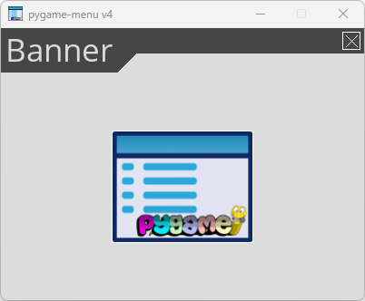

.. code-block:: python

    menu = pygame_menu.Menu(...)

    image = pygame_menu.BaseImage(
        image_path=pygame_menu.baseimage.IMAGE_EXAMPLE_PYGAME_MENU
    ).scale(0.25, 0.25)
    menu.add.banner(image, pygame_menu.events.EXIT)

.. automethod:: pygame_menu._widgetmanager.WidgetManager.banner

Add a choices list (selector)
-----------------------------

A selector gives the possibility choose a value in a predefined list. An item of
a selector is a tuple: the first element is the text displayed, the others are
the arguments passed to the callbacks ``onchange`` and ``onreturn``.

**Example:**

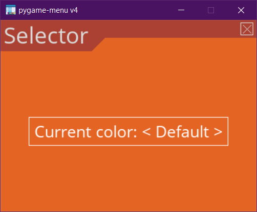

.. code-block:: python

    menu = pygame_menu.Menu(...)

    def change_background_color(selected_value, color, **kwargs):
        value_tuple, index = selected_value
        print('Change widget color to', value_tuple[0])  # selected_value ('Color', surface, color)
        if color == (-1, -1, -1):  # Generate a random color
            color = (randrange(0, 255), randrange(0, 255), randrange(0, 255))
        widget: 'pygame_menu.widgets.Selector' = kwargs.get('widget')
        widget.update_font({'selected_color': color})
        widget.get_selection_effect().color = color

    items = [('Default', (255, 255, 255)),
             ('Black', (0, 0, 0)),
             ('Blue', (0, 0, 255)),
             ('Random', (-1, -1, -1))]
    selector = menu.add.selector(
        title='Current color:\t',
        items=items,
        onreturn=change_background_color,  # User press "Return" button
        onchange=change_background_color  # User changes value with left/right keys
    )
    selector.add_self_to_kwargs()  # Callbacks will receive widget as parameter
    selector2 = menu.add.selector(
        title='New color:',
        items=items,
        style=pygame_menu.widgets.SELECTOR_STYLE_FANCY
    )

.. automethod:: pygame_menu._widgetmanager.WidgetManager.selector

Add a clock
-----------

A clock is a simple label object which updates the title text with a generator
that retrieves the clock/date string from ``time.strftime``.

**Example:**

.. image:: ../_static/widget_clock.png
    :scale: 75%
    :align: center

.. code-block:: python

    menu = pygame_menu.Menu(...)

    clock = menu.add.clock(font_size=25, font_name=pygame_menu.font.FONT_DIGITAL)

.. automethod:: pygame_menu._widgetmanager.WidgetManager.clock

Add a color entry
-----------------

A color input is similar as a text input but with a limited choice of characters
to enter a RGB value of HEX decimal one. There is also a area to show the current
color. By default the RGB integers separator is a comma (``,``).

**Example:**

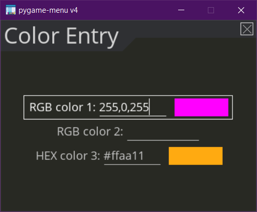

.. code-block:: python

    menu = pygame_menu.Menu(...)

    def check_color(value):
        print('New color:', value)

    menu.add.color_input('RGB color 1: ',
                         color_type=pygame_menu.widgets.COLORINPUT_TYPE_RGB,
                         default=(255, 0, 255), font_size=18)
    menu.add.color_input('RGB color 2: ',
                         color_type=pygame_menu.widgets.COLORINPUT_TYPE_RGB,
                         input_separator='-', font_size=18)
    menu.add.color_input('HEX color 3: ',
                         color_type=pygame_menu.widgets.COLORINPUT_TYPE_HEX,
                         default='#ffaa11', font_size=18)

.. automethod:: pygame_menu._widgetmanager.WidgetManager.color_input

Add a drop selection
--------------------

A drop selector gives the possibility choose a value in a predefined list. An item
of a drop selector is a tuple: the first element is the text displayed, the others
are the arguments passed to the callbacks ``onchange`` and ``onreturn``.

**Example:**

.. image:: ../_static/widget_dropselect.png
    :scale: 75%
    :align: center

.. code-block:: python

    menu = pygame_menu.Menu(...)

    selector_epic = menu.add.dropselect(
        title='Is pygame-menu epic?',
        items=[('Yes', 0),
               ('Absolutely Yes', 1)],
        font_size=16,
        selection_option_font_size=20
    )
    selector_sum = menu.add.dropselect(
        title='What is the value of π?',
        items=[('3 (Engineer)', 0),
               ('3.1415926535897932384626433832795028841971693993751058209', 1),
               ('4', 2),
               ('I don\'t know what is π', 3)],
        font_size=16,
        selection_box_width=173,
        selection_option_padding=(0, 5),
        selection_option_font_size=20
    )
    selector_country = menu.add.dropselect(
        title='Pick a country',
        items=[('Argentina', 'ar'),
               ('Australia', 'au'),
               ('Bolivia', 'bo'),
               ('Chile', 'ch'),
               ('China', 'cn'),
               ('Finland', 'fi'),
               ('France', 'fr'),
               ('Germany', 'de'),
               ('Italy', 'it'),
               ('Japan', 'jp'),
               ('Mexico', 'mx'),
               ('Peru', 'pe'),
               ('United States', 'us')],
        font_size=20,
        default=3,
        open_middle=True,  # Opens in the middle of the menu
        selection_box_height=5,
        selection_box_width=212,
        selection_infinite=True,
        selection_option_font_size=20
    )

.. automethod:: pygame_menu._widgetmanager.WidgetManager.dropselect

Add a drop selection multiple
-----------------------------

A multiple drop selector gives the possibility choose a value in a predefined list.
An item of a drop selector is a tuple: the first element is the text displayed,
the others are the arguments passed to the callbacks ``onchange`` and ``onreturn``.

**Example:**

.. image:: ../_static/widget_dropselect_multiple.png
    :scale: 75%
    :align: center

.. code-block:: python

    menu = pygame_menu.Menu(...)

    selector = menu.add.dropselect_multiple(
        title='Pick 3 colors',
        items=[('Black', (0, 0, 0)),
               ('Blue', (0, 0, 255)),
               ('Cyan', (0, 255, 255)),
               ('Fuchsia', (255, 0, 255)),
               ('Green', (0, 255, 0)),
               ('Red', (255, 0, 0)),
               ('White', (255, 255, 255)),
               ('Yellow', (255, 255, 0))],
        font_size=23,
        max_selected=3,
        selection_option_font_size=23
    )

.. automethod:: pygame_menu._widgetmanager.WidgetManager.dropselect_multiple

Add a frame
-----------

Frame is a widget container, it can pack many widgets both horizontally or
vertically. All widgets within a same Frame count as one widget position, so
using Frames is useful when designing column/row layout. Frames can contain
widgets or even more frames.

There is two types of frames, horizontal (h) and vertical (v) ones. These change
the way the widgets are added to the frame (packed).

**Example:**

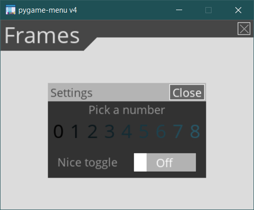

.. code-block:: python

    menu = pygame_menu.Menu(...)

    frame = menu.add.frame_v(250, 150, background_color=(50, 50, 50), padding=0)
    frame_title = menu.add.frame_h(250, 29, background_color=(180, 180, 180), padding=0)
    frame_content = menu.add.frame_v(250, 120, padding=0)
    frame.pack(frame_title)
    frame.pack(frame_content)

    frame_title.pack(menu.add.label('Settings', padding=0), margin=(2, 2))
    frame_title.pack(
        menu.add.button('Close', pygame_menu.events.EXIT, padding=(0, 5),
                        background_color=(100, 100, 100)),
        align=pygame_menu.locals.ALIGN_RIGHT, margin=(2, 2))
    frame_content.pack(
        menu.add.label('Pick a number', font_color=(150, 150, 150)),
        align=pygame_menu.locals.ALIGN_CENTER)
    frame_numbers = menu.add.frame_h(250, 41, padding=0)
    frame_content.pack(frame_numbers)
    for i in range(9):
        frame_numbers.pack(
            menu.add.button(i, font_color=(5 * i, 11 * i, 13 * i),
                            padding=(0, 5), font_size=30),
            align=pygame_menu.locals.ALIGN_CENTER)
    frame_content.pack(menu.add.vertical_margin(15))
    frame_content.pack(
        menu.add.toggle_switch('Nice toggle', False, width=100,
                               font_color=(150, 150, 150), padding=0),
        align=pygame_menu.locals.ALIGN_CENTER)

**Example:**

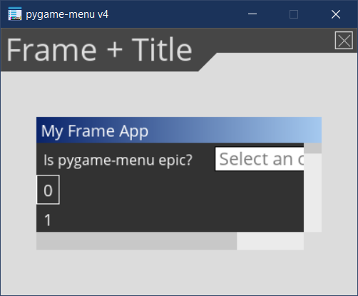

.. code-block:: python

    menu = pygame_menu.Menu(...)

    frame = menu.add.frame_v(400, 800, background_color=(50, 50, 50), padding=0,
                             max_width=300, max_height=100)
    frame.set_title('My Frame App', title_font_color='white', padding_inner=(2, 5))

    frame.pack(menu.add.dropselect(
        title='Is pygame-menu epic?',
        items=[('Yes', 0),
               ('Absolutely Yes', 1)],
        font_color='white',
        font_size=16,
        selection_option_font_size=20
    ))
    for i in range(20):
        frame.pack(menu.add.button(i, font_color='white', button_id=f'b{i}'))

.. automethod:: pygame_menu._widgetmanager.WidgetManager.frame_h

.. automethod:: pygame_menu._widgetmanager.WidgetManager.frame_v

Add a generic widget
--------------------

A user-created widget can also be added to the menu. The widget must be fully
configured before the addition.

**Example:**

.. code-block:: python

    def check_color(value):
        print('New color:', value)

    menu = pygame_menu.Menu(...)

    widget_label = pygame_menu.widgets.Label(...)
    widget_image = pygame_menu.widgets.Image(...)

    # This applies menu default widget configuration
    menu.add.generic_widget(widget_label, configure_defaults=True)

    # Adds menu without default configuration
    menu.add.generic_widget(widget_image)

.. automethod:: pygame_menu._widgetmanager.WidgetManager.generic_widget

Add a label
-----------

A label is used to display a text. If the text is too large, it can be wrapped in
order to fit the menu size.

**Example:**

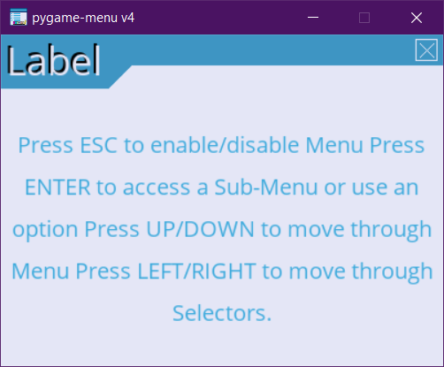

.. code-block:: python

    menu = pygame_menu.Menu(...)

    HELP = 'Press ESC to enable/disable Menu ' \
           'Press ENTER to access a Sub-Menu or use an option ' \
           'Press UP/DOWN to move through Menu ' \
           'Press LEFT/RIGHT to move through Selectors.'
    menu.add.label(HELP, max_char=-1, font_size=20)

.. automethod:: pygame_menu._widgetmanager.WidgetManager.label

Add a menu link
---------------

Menu links are widgets that opens a new Menu within the parent Menu without using
a button. Links can be opened using the ``open`` method.

**Example:**

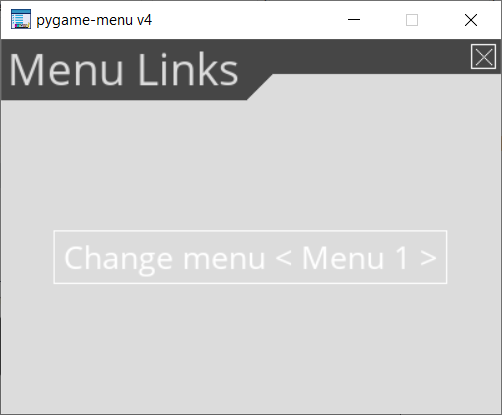

.. code-block:: python

    menu = pygame_menu.Menu(...)
    menu1 = pygame_menu.Menu(...)
    menu2 = pygame_menu.Menu(...)
    menu3 = pygame_menu.Menu(...)

    def open_link(*args) -> None:
        link: 'pygame_menu.widgets.MenuLink' = args[-1]
        link.open()

    # Create the links
    link1 = menu.add.menu_link(menu1)
    link2 = menu.add.menu_link(menu2)
    link3 = menu.add.menu_link(menu3)

    # Add a selection object, which opens the links
    sel = menu.add.selector('Change menu ', [
        ('Menu 1', link1),
        ('Menu 2', link2),
        ('Menu 3', link3)
    ], onreturn=open_link)

.. automethod:: pygame_menu._widgetmanager.WidgetManager.menu_link

Add a none widget
-----------------

A none widget is used to fill column/row layout, store information or even add
drawing callbacks for being executed on each menu draw.

.. code-block:: python

    menu = pygame_menu.Menu(...)

    menu.add.none_widget()

.. automethod:: pygame_menu._widgetmanager.WidgetManager.none_widget

Add a progress bar
------------------

A progress bar widget, which accepts a percentage from ``0`` to ``100``.

**Example:**

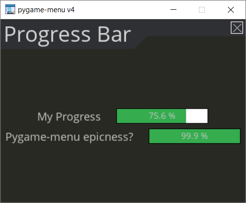

.. code-block:: python

    menu = pygame_menu.Menu(...)

    progress1 = menu.add.progress_bar('My Progress', default=75.6)
    progress2 = menu.add.progress_bar('Pygame-menu epicness?', default=99.9)

.. automethod:: pygame_menu._widgetmanager.WidgetManager.progress_bar

Add a range slider
------------------

A range slider offers 1 or 2 sliders for defining a unique value or a range of numeric
ones; values can be continuous or discrete.

**Example:**

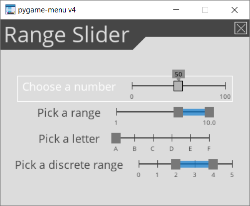

.. code-block:: python

    menu = pygame_menu.Menu(...)

    # Single value
    menu.add.range_slider('Choose a number', 50, (0, 100), 1,
                          rangeslider_id='range_slider',
                          value_format=lambda x: str(int(x)))

    # Range
    menu.add.range_slider('Pick a range', (7, 10), (1, 10), 1)

    # Discrete value
    range_values_discrete = {0: 'A', 1: 'B', 2: 'C', 3: 'D', 4: 'E', 5: 'F'}
    menu.add.range_slider('Pick a letter', 0, list(range_values_discrete.keys()),
                          slider_text_value_enabled=False,
                          value_format=lambda x: range_values_discrete[x])

    # Numeric discrete range
    menu.add.range_slider('Pick a discrete range', (2, 4), [0, 1, 2, 3, 4, 5], 1)

.. automethod:: pygame_menu._widgetmanager.WidgetManager.range_slider

Add a surface
-------------

A surface widget only accepts an external surface which is drawn on the Menu. The
widget size is the same as the surface, considering also the margin and the padding.

**Example:**

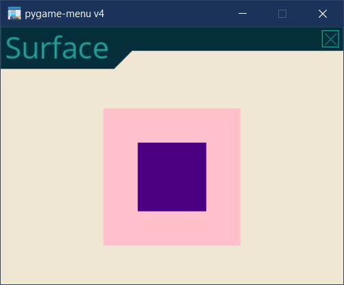

.. code-block:: python

    menu = pygame_menu.Menu(...)

    new_surface = pygame.Surface((160, 160))
    new_surface.fill((255, 192, 203))
    inner_surface = pygame.Surface((80, 80))
    inner_surface.fill((75, 0, 130))
    new_surface.blit(inner_surface, (40, 40))
    menu.add.surface(new_surface)

.. automethod:: pygame_menu._widgetmanager.WidgetManager.surface

Add a table
-----------

A table is a frame which packs widgets in a structured way. Tables can contain a
text, numbers, or even more widgets (Frames, Tables, Images, etc). All widgets are
read-only, them do not accept any event, only scrollable frames work.

**Example:**

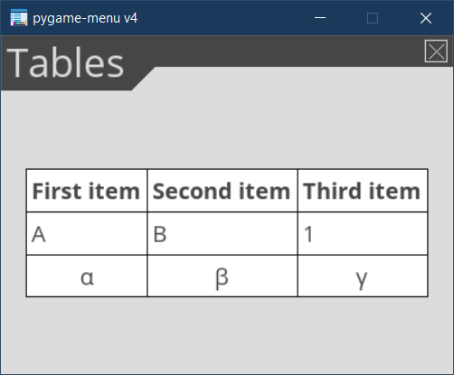

.. code-block:: python

    menu = pygame_menu.Menu(...)

    table = menu.add.table(table_id='my_table', font_size=20)
    table.default_cell_padding = 5
    table.default_row_background_color = 'white'
    table.add_row(['First item', 'Second item', 'Third item'],
                  cell_font=pygame_menu.font.FONT_OPEN_SANS_BOLD)
    table.add_row(['A', 'B', 1])
    table.add_row(['α', 'β', 'γ'], cell_align=pygame_menu.locals.ALIGN_CENTER)

The following example show an advanced example, featuring tables within a table,
and a widget (Image):

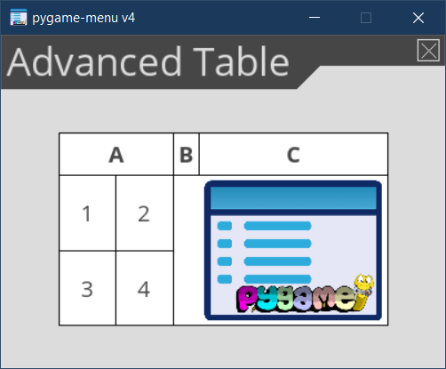

.. code-block:: python

    menu = pygame_menu.Menu(...)

    table = menu.add.table(font_size=20)
    table.default_cell_padding = 5
    table.default_cell_align = pygame_menu.locals.ALIGN_CENTER
    table.default_row_background_color = 'white'
    table.add_row(['A', 'B', 'C'],
                  cell_font=pygame_menu.font.FONT_OPEN_SANS_BOLD)

    # Sub-table
    table_2 = menu.add.table(font_size=20)
    table_2.default_cell_padding = 20
    table_2.add_row([1, 2])
    table_2.add_row([3, 4])

    # Sub image
    image = menu.add.image(pygame_menu.baseimage.IMAGE_EXAMPLE_PYGAME_MENU)
    image.scale(0.25, 0.25)

    # Add the sub-table and the image
    table.add_row([table_2, '', image],
                  cell_vertical_position=pygame_menu.locals.POSITION_CENTER)
    table.update_cell_style(1, 2, padding=0)  # Disable padding for cell column 1, row 2 (table_2)
    table.update_cell_style(2, 2, border_position=pygame_menu.locals.POSITION_SOUTH)
    table.update_cell_style(3, 2, border_position=(pygame_menu.locals.POSITION_SOUTH,
                                                   pygame_menu.locals.POSITION_EAST))

.. automethod:: pygame_menu._widgetmanager.WidgetManager.table

Add a text entry
----------------

A text input permits to enter a string using a keyboard. Restriction on entered
characters can be set using ``input_type``, ``maxchar``, ``maxwidth`` and
``valid_chars`` parameters.

**Example:**

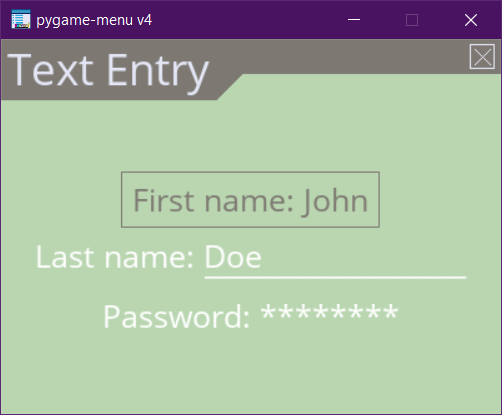

.. code-block:: python

    menu = pygame_menu.Menu(...)

    def check_name(value):
        print('User name:', value)

    menu.add.text_input('First name: ', default='John', onreturn=check_name)
    menu.add.text_input('Last name: ', default='Doe', maxchar=10, input_underline='_')
    menu.add.text_input('Password: ', input_type=pygame_menu.locals.INPUT_INT, password=True)

.. automethod:: pygame_menu._widgetmanager.WidgetManager.text_input

Add a toggle switch
-------------------

A fully customizable switch between two states (``On``, ``Off``). If you need
more options, take a look at the ``ToggleSwitch`` widget class.

**Example:**

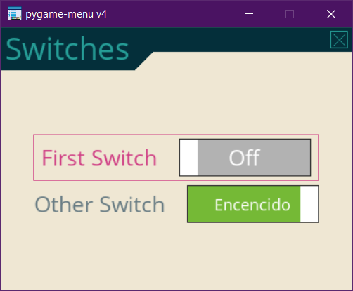

.. code-block:: python

    menu = pygame_menu.Menu(...)

    menu.add.toggle_switch('First Switch', False, toggleswitch_id='first_switch')
    menu.add.toggle_switch('Other Switch', True, toggleswitch_id='second_switch',
                           state_text=('Apagado', 'Encendido'), state_text_font_size=18)

.. automethod:: pygame_menu._widgetmanager.WidgetManager.toggle_switch

Add a vertical fill
-------------------

A vertical fill adds a vertical margin to fill the menu height. It depends on other
vertical fillers in the same column, i.e., if three vertical fillers are in the same
column, them will take a third of the available vertical space.

**Example:**

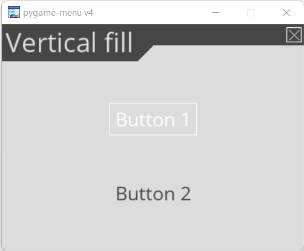

.. code-block:: python

    menu = pygame_menu.Menu(...)

    menu.add.vertical_fill()
    menu.add.button('Button 1')
    menu.add.vertical_fill()
    menu.add.button('Button 2')
    menu.add.vertical_fill()

.. automethod:: pygame_menu._widgetmanager.WidgetManager.vertical_fill

Add a vertical spacer
---------------------

A vertical spacer can be added between two widgets to have a better visual
rendering of the menu.

**Example:**

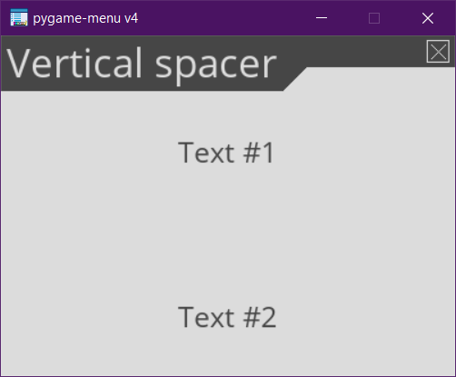

.. code-block:: python

    menu = pygame_menu.Menu(...)

    menu.add.label('Text #1')
    menu.add.vertical_margin(100)
    menu.add.label('Text #2')

.. automethod:: pygame_menu._widgetmanager.WidgetManager.vertical_margin

Add a url link
--------------

Adds a clickable url link.

**Example:**

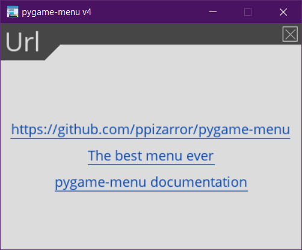

.. code-block:: python

    menu = pygame_menu.Menu(...)

    menu.add.url('https://github.com/ppizarror/pygame-menu')
    menu.add.url('https://github.com/ppizarror/pygame-menu', 'The best menu ever')
    menu.add.url('https://pygame-menu.readthedocs.io/en/master/', 'pygame-menu documentation')

.. automethod:: pygame_menu._widgetmanager.WidgetManager.url

Add an image
------------

An image can be displayed on a menu. The ``scale`` parameter represent the
scaling ratio of the image width and height. When ``scale_smooth=True``, the
rendering is better but it requires more CPU resources.

**Example:**

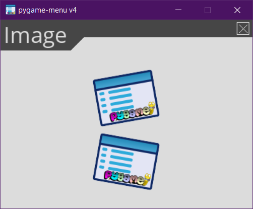

.. code-block:: python

    menu = pygame_menu.Menu(...)

    image_path = pygame_menu.baseimage.IMAGE_EXAMPLE_PYGAME_MENU
    menu.add.image(image_path, angle=10, scale=(0.15, 0.15))
    menu.add.image(image_path, angle=-10, scale=(0.15, 0.15))

.. automethod:: pygame_menu._widgetmanager.WidgetManager.image
