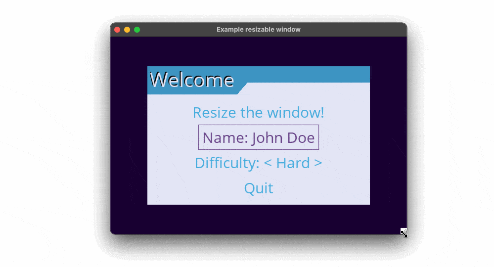
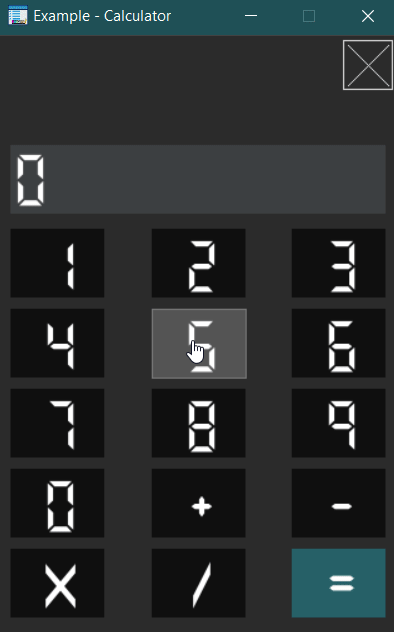
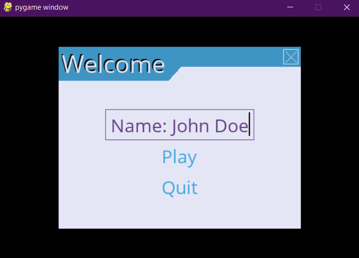
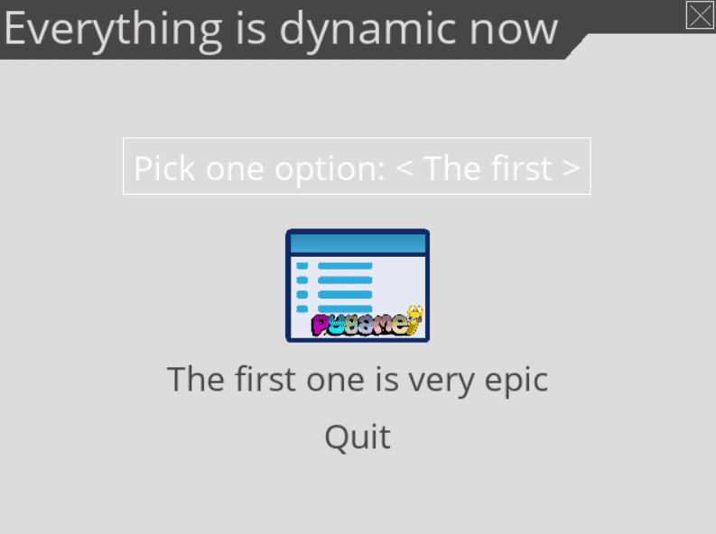
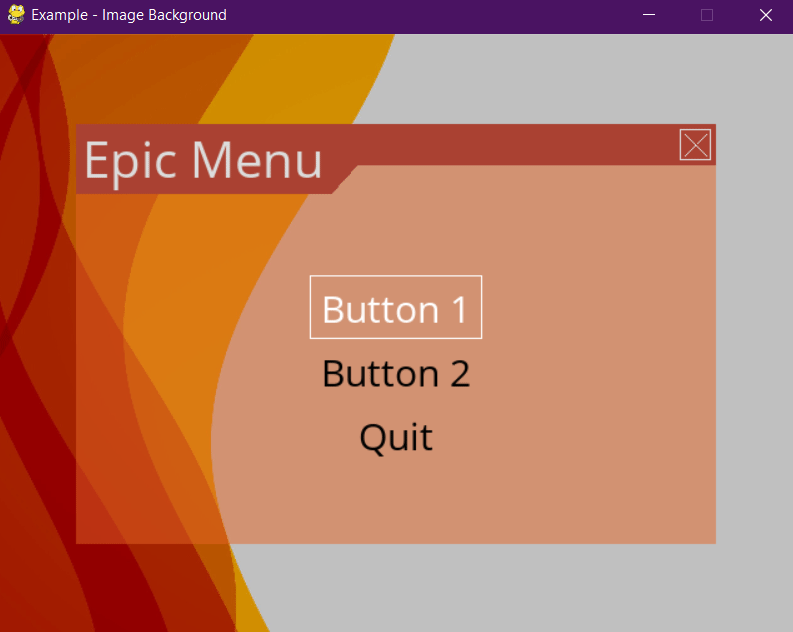
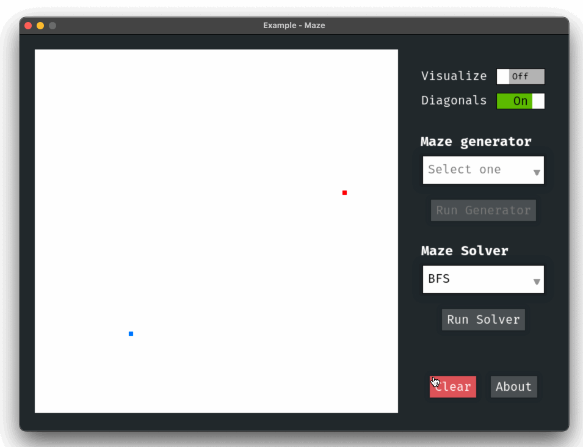
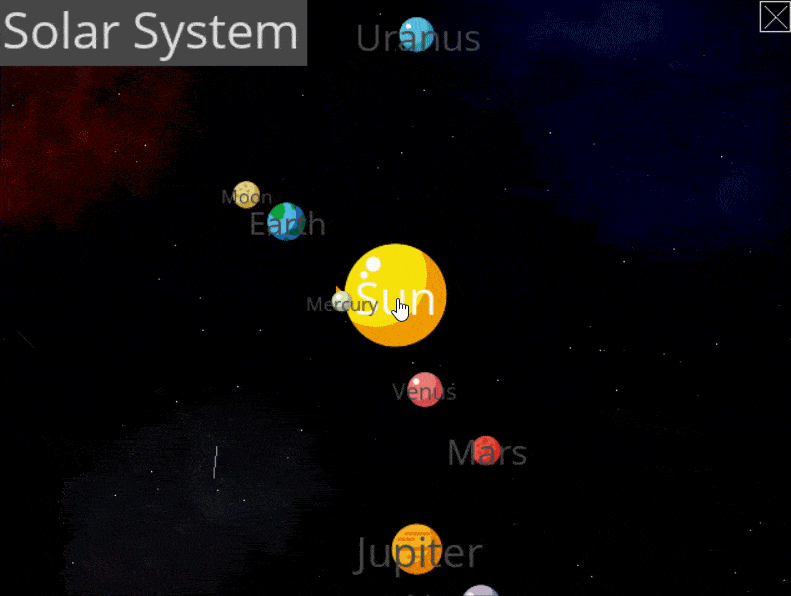

==================
Gallery / Examples
==================

Several examples are provided with the :py:mod:`pygame_menu` library. To run the
examples, simply execute these commands in a terminal:

.. code-block:: bash

    $> python3 -m pygame_menu.examples.game_selector
    $> python3 -m pygame_menu.examples.multi_input
    $> python3 -m pygame_menu.examples.scroll_menu
    $> python3 -m pygame_menu.examples.simple
    $> python3 -m pygame_menu.examples.timer_clock
    $> python3 -m pygame_menu.examples.window_resize

Other examples that show specific use cases of the menu are also provided:

.. code-block:: bash

    $> python3 -m pygame_menu.examples.other.calculator
    $> python3 -m pygame_menu.examples.other.dynamic_button_append
    $> python3 -m pygame_menu.examples.other.dynamic_widget_update
    $> python3 -m pygame_menu.examples.other.image_background
    $> python3 -m pygame_menu.examples.other.maze
    $> python3 -m pygame_menu.examples.other.scrollbar
    $> python3 -m pygame_menu.examples.other.scrollbar_area
    $> python3 -m pygame_menu.examples.other.ui_solar_system
    $> python3 -m pygame_menu.examples.other.widget_positioning

Them can also be imported as follows:

.. code-block:: python

    from pygame_menu.examples.example import main

    main()

Example sources can also be found in the
`Github repo <https://github.com/ppizarror/pygame-menu/tree/master/pygame_menu/examples>`_.
Also, check out widget-specific examples in the
`Adding Widgets <https://pygame-menu.readthedocs.io/en/latest/_source/add_widgets.html>`_
documentation page.

Game selector example
---------------------

.. image:: ../_static/example_game_selector.gif
    :align: center
    :alt: A simple game selector
    :width: 600

Source: `examples/game_selector.py <https://github.com/ppizarror/pygame-menu/blob/master/pygame_menu/examples/game_selector.py>`_

Multiple input example
----------------------

.. image:: ../_static/example_multi_input.gif
    :align: center
    :alt: This example features all widgets available on pygame-menu
    :width: 600

Source: `examples/multi_input.py <https://github.com/ppizarror/pygame-menu/blob/master/pygame_menu/examples/multi_input.py>`_

Scroll menu example
-------------------

.. image:: ../_static/example_scroll_menu.gif
    :align: center
    :alt: Since v3, menu supports scrolls
    :width: 600

Source: `examples/scroll_menu.py <https://github.com/ppizarror/pygame-menu/blob/master/pygame_menu/examples/scroll_menu.py>`_

Simple example
--------------

.. image:: ../_static/example_simple.gif
    :align: center
    :alt: A basic button menu
    :width: 600

Source: `examples/simple.py <https://github.com/ppizarror/pygame-menu/blob/master/pygame_menu/examples/simple.py>`_

Timer clock example
-------------------

.. image:: ../_static/example_timer_clock.gif
    :align: center
    :alt: Timer clock
    :width: 600

Source: `examples/timer_clock.py <https://github.com/ppizarror/pygame-menu/blob/master/pygame_menu/examples/timer_clock.py>`_

Window resize example
------------------------

Source: `examples/window_resize.py <https://github.com/ppizarror/pygame-menu/blob/master/pygame_menu/examples/window_resize.py>`_

Other - Calculator (Decoration, Events, OOP, Frames)
----------------------------------------------------

Source: `examples/other/calculator.py <https://github.com/ppizarror/pygame-menu/blob/master/pygame_menu/examples/other/calculator.py>`_

Other - Dynamic button append
-----------------------------

Source: `examples/other/dynamic_button_append.py <https://github.com/ppizarror/pygame-menu/blob/master/pygame_menu/examples/other/dynamic_button_append.py>`_

Other - Dynamic widget update (OOP style)
-----------------------------------------

Source: `examples/other/dynamic_widget_update.py <https://github.com/ppizarror/pygame-menu/blob/master/pygame_menu/examples/other/dynamic_widget_update.py>`_

Other - Image background
------------------------

Source: `examples/other/image_background.py <https://github.com/ppizarror/pygame-menu/blob/master/pygame_menu/examples/other/image_background.py>`_

Other - Maze Pathfinder (GUI)
-----------------------------

Source: `examples/other/maze.py <https://github.com/ppizarror/pygame-menu/blob/master/pygame_menu/examples/other/maze.py>`_

Other - Solar System (OOP, UI, Advanced, Decorations)
-----------------------------------------------------

Source: `examples/other/ui_solar_system.py <https://github.com/ppizarror/pygame-menu/blob/master/pygame_menu/examples/other/ui_solar_system.py>`_

Other - Widget positioning (OOP, UI, Advanced, Decorations)
-----------------------------------------------------------

.. image:: ../_static/example_other_widget_positioning.png
    :align: center
    :alt: Set custom positions to each widget
    :width: 600

Source: `examples/other/widget_positioning.py <https://github.com/ppizarror/pygame-menu/blob/master/pygame_menu/examples/other/widget_positioning.py>`_
