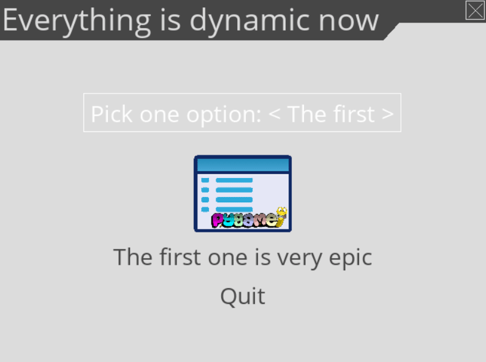

==================
Gallery / Examples
==================

Several examples are provided with the :py:mod:`pygame_menu` library.
To run the examples, simply execute these commands in a terminal:

.. code-block:: bash

    $> python -m pygame_menu.examples.simple
    $> python -m pygame_menu.examples.game_selector
    $> python -m pygame_menu.examples.multi_input
    $> python -m pygame_menu.examples.scroll_menu
    $> python -m pygame_menu.examples.timer_clock

Other examples that show specific use cases of the menu are also provided:

.. code-block:: bash

    $> python -m pygame_menu.examples.other.dynamic_button_append
    $> python -m pygame_menu.examples.other.dynamic_widget_update
    $> python -m pygame_menu.examples.other.image_background

Them can also be imported as follows:

.. code-block:: python

    from pygame_menu.examples.example import main

    main()

Example sources can also be found in the `Github repo <https://github.com/ppizarror/pygame-menu/tree/master/pygame_menu/examples>`_.

Simple example
--------------

.. image:: ../_static/example_simple.gif
    :align: center
    :alt: A basic button menu
    :width: 590

Source: `examples/simple.py <https://github.com/ppizarror/pygame-menu/blob/master/pygame_menu/examples/simple.py>`_

Game selector example
---------------------

.. image:: ../_static/example_game_selector.gif
    :align: center
    :alt: A simple game selector
    :width: 590

Source: `examples/game_selector.py <https://github.com/ppizarror/pygame-menu/blob/master/pygame_menu/examples/game_selector.py>`_

Multiple input example
----------------------

.. image:: ../_static/example_multi_input.gif
    :align: center
    :alt: This example features all widgets available on pygame-menu
    :width: 590

Source: `examples/multi_input.py <https://github.com/ppizarror/pygame-menu/blob/master/pygame_menu/examples/multi_input.py>`_

Scroll menu example
-------------------

.. image:: ../_static/example_scroll_menu.gif
    :align: center
    :alt: Since v3, menu supports scrolls
    :width: 590

.. image:: ../_static/example_columns.gif
    :align: center
    :alt: Since v3, menu supports columns and scrolls
    :width: 590

Source: `examples/scroll_menu.py <https://github.com/ppizarror/pygame-menu/blob/master/pygame_menu/examples/scroll_menu.py>`_

Timer clock example
-------------------

.. image:: ../_static/example_timer_clock.gif
    :align: center
    :alt: Timer clock
    :width: 590

Source: `examples/timer_clock.py <https://github.com/ppizarror/pygame-menu/blob/master/pygame_menu/examples/timer_clock.py>`_

(Other) Dynamic button append
-----------------------------

.. image:: ../_static/example_other_dynamic_button_append.gif
    :align: center
    :alt: Dynamic button append
    :width: 590

Source: `examples/other/dynamic_button_append.py <https://github.com/ppizarror/pygame-menu/blob/master/pygame_menu/examples/other/dynamic_button_append.py>`_

(Other) Dynamic widget update (OPP style)
-----------------------------------------

Source: `examples/other/dynamic_widget_update.py <https://github.com/ppizarror/pygame-menu/blob/master/pygame_menu/examples/other/dynamic_widget_update.py>`_

(Other) Image background
------------------------

.. image:: ../_static/example_other_image_background.gif
    :align: center
    :alt: Image background
    :width: 590

Source: `examples/other/image_background.py <https://github.com/ppizarror/pygame-menu/blob/master/pygame_menu/examples/other/image_background.py>`_