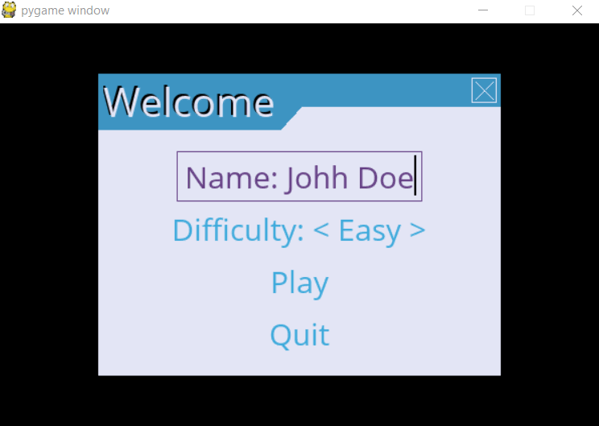
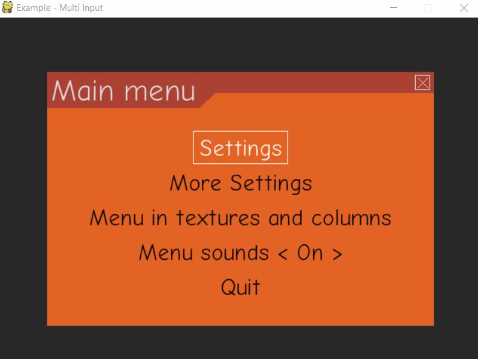
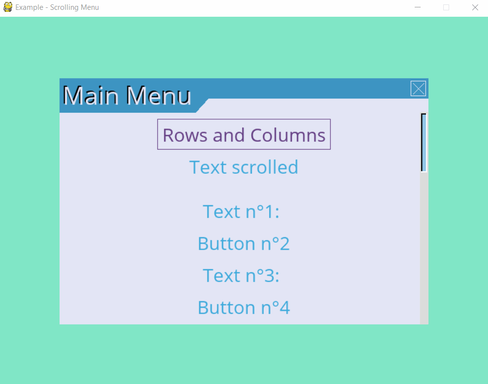
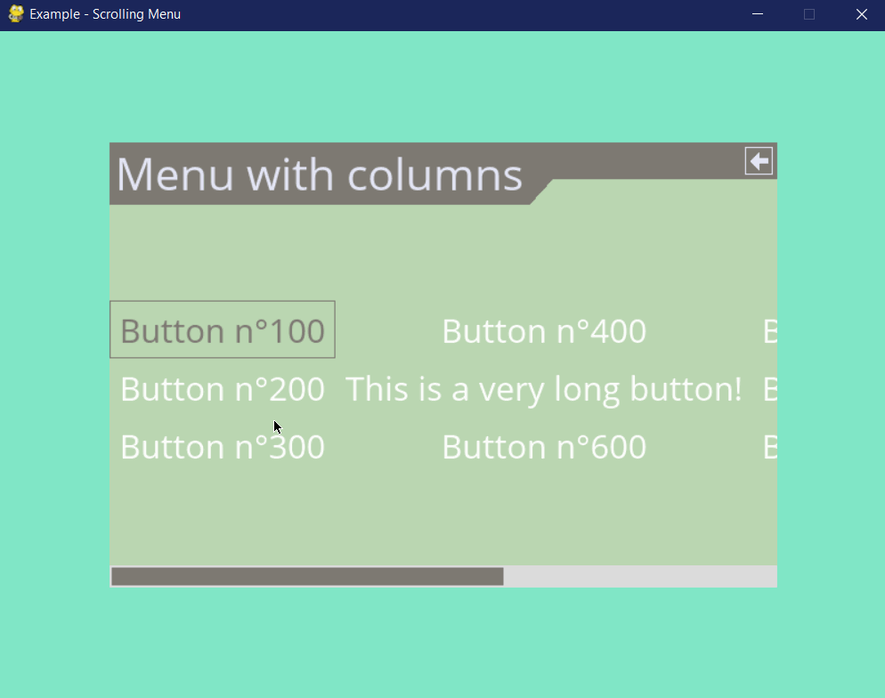
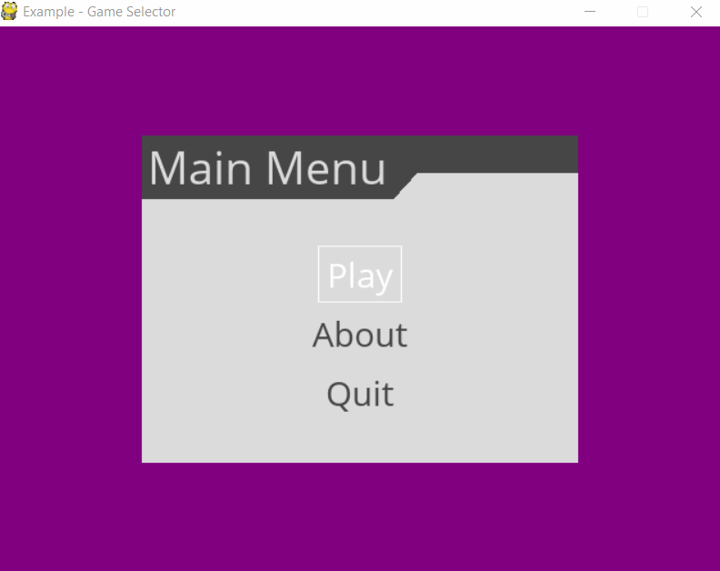
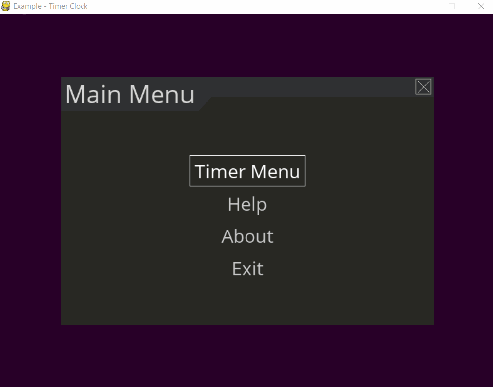

=======
Gallery
=======

Several examples are provided with the :py:mod:`pygame_menu` library.
To run the examples, simply execute these commands in a terminal:

.. code-block:: bash

    $> python -m pygame_menu.examples.simple
    $> python -m pygame_menu.examples.game_selector
    $> python -m pygame_menu.examples.multi_input
    $> python -m pygame_menu.examples.scroll_menu
    $> python -m pygame_menu.examples.timer_clock

Them can also be imported as follows:

.. code-block:: python

    from pygame_menu.examples.example import main

    main()

Examples can also be found in the `Github repo <https://github.com/ppizarror/pygame-menu/tree/master/pygame_menu/examples>`_.

Simple example
--------------

Multiple input example
----------------------

Scroll menu example
-------------------

Columns example
-------------------

Game selector example
---------------------

Timer clock example
-------------------

