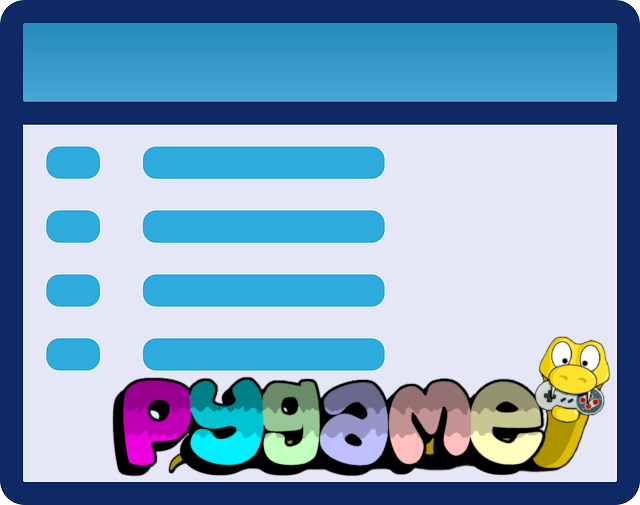
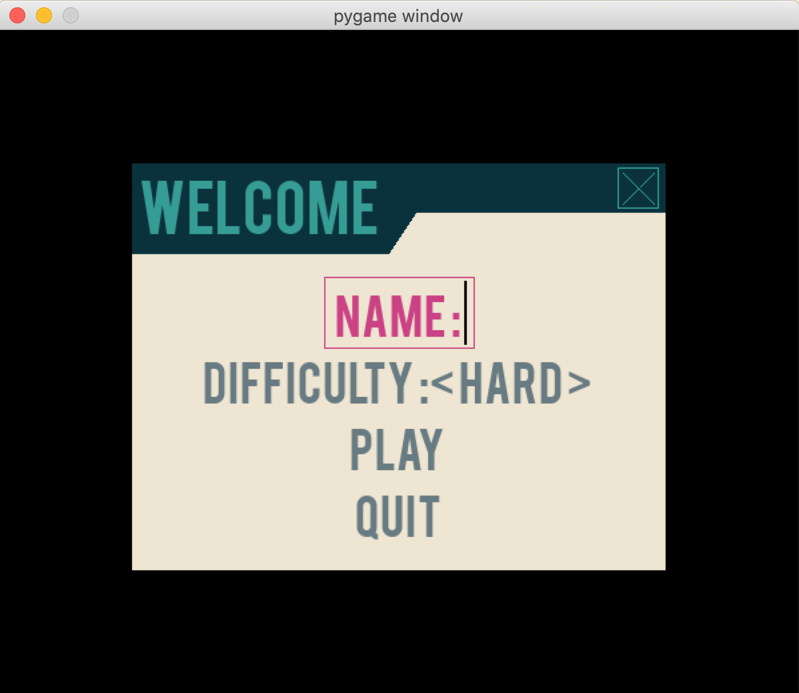

:orphan:

.. This page is orphan because it is the documentation entry point

.. include:: ../README.rst

===========
First steps
===========

Making games using :py:mod:`pygame` is really cool, but most games
(or applications) require end-user configuration. Creating complex GUI
objects to display a menu can be painful. That why :py:mod:`pygame-menu`
was designed.

Here is a simple example of how to create a menu with :py:mod:`pygame-menu`
(the code is available in `pygame_menu.examples.simple.py <https://github.com/ppizarror/pygame-menu/tree/master/pygame_menu/examples/simple.py>`_):

1. Import the required libraries

.. code-block:: python

    import pygame
    import pygame_menu

2. Initialize pygame

.. code-block:: python

    pygame.init()
    surface = pygame.display.set_mode((600, 400))

3. Make your menu

.. code-block:: python

    def set_difficulty(value, difficulty):
        # Do the job here !
        pass

    def start_the_game():
        # Do the job here !
        pass

    menu = pygame_menu.Menu(300, 400, 'Welcome',
                           theme=pygame_menu.themes.THEME_BLUE)

    menu.add_text_input('Name :', default='John Doe')
    menu.add_selector('Difficulty :', [('Hard', 1), ('Easy', 2)], onchange=set_difficulty)
    menu.add_button('Play', start_the_game)
    menu.add_button('Quit', pygame_menu.events.EXIT)

4. Run your menu

.. code-block:: python

    menu.mainloop(surface)

   Tadada... !!! Such a beautiful menu ＼(^o^)／

**Interested in** :ref:`going deeper into menu design <Creating menus>` **?**

.. toctree::
   :maxdepth: 2
   :hidden:
   :caption: First steps

   _source/create_menu
   _source/add_widgets
   _source/add_sounds
   _source/themes
   _source/gallery
   _source/migration_guide

==============
Advanced usage
==============

This chapter define rules and advanced tips and tricks to develop extensions
for :py:mod:`pygame-menu`. The main addressed topics are:

- :ref:`Creating a widget <Create a widget>`
- :ref:`Creating a selection effect <Create a selection effect>`

.. toctree::
   :maxdepth: 2
   :hidden:
   :caption: Advanced usage

   _source/advanced

===========
Widgets API
===========

A menu is in fact a list of widgets arranged on the same surface.
Access to a widget in a menu can easily be done with two methods:

.. code-block:: python

    widget = menu.get_widget('MyWidgetID')

    selected = menu.get_selected_widget()

Each :py:mod:`pygame_menu` widget and its behaviors are defined in a
class. The currently existing classes are:

 - :py:class:`~pygame_menu.widgets.Button`
 - :py:class:`~pygame_menu.widgets.ColorInput`
 - :py:class:`~pygame_menu.widgets.Image`
 - :py:class:`~pygame_menu.widgets.Label`
 - :py:class:`~pygame_menu.widgets.MenuBar`
 - :py:class:`~pygame_menu.widgets.ScrollBar`
 - :py:class:`~pygame_menu.widgets.Selector`
 - :py:class:`~pygame_menu.widgets.TextInput`
 - :py:class:`~pygame_menu.widgets.VMargin`

For advanced programmers, those classes can be used to design custom
menus or windows.

Have a look at `pygame_menu.widgets.examples.scrollbar.py <https://github.com/ppizarror/pygame-menu/tree/master/pygame_menu/widgets/examples/scrollbar.py>`_ for
instance. It shows how to use the :py:class:`pygame_menu.widgets.ScrollBar`
class to display large custom surfaces.

.. toctree::
   :maxdepth: 2
   :hidden:
   :caption: Widgets API

   _source/widgets_button
   _source/widgets_colorinput
   _source/widgets_image
   _source/widgets_label
   _source/widgets_menubar
   _source/widgets_scrollbar
   _source/widgets_selector
   _source/widgets_textinput
   _source/widgets_vmargin

=================
About pygame-menu
=================

This project does not have a mailing list and so the issues tab should
be the first point of contact if wishing to discuss the project. If you
have questions that you do not feel are relevant to the issues tab or
just want to let me know what you think about the library, feel free to
email me at pablo@ppizarror.com

.. toctree::
   :maxdepth: 2
   :hidden:
   :caption: About pygame-menu

   _source/license
   _source/contributors

==================
Indices and tables
==================

* :ref:`genindex`
* :ref:`modindex`
* :ref:`search`
